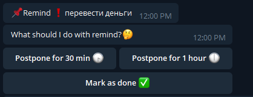
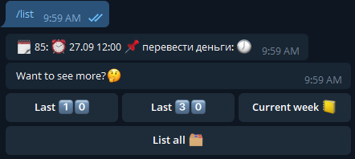

   


# README

This is a RemindMe Bot. It will help you remember important things through Telegram.
You can add this bot at Telegram as @how_to_find_name_for_bot or by the [link](https://t.me/how_to_find_name_for_bot)

## Available commands


## Interface

### Remind


### List (today)



# Installing

This bot is created with [python-telegram-bot](https://github.com/python-telegram-bot/python-telegram-bot)

## Requirments

 - python 3.5+
 - Postgresql 11+
 - python-telegram-bot library v (see in [requirments](requirments.txt))

## Configuring environment

Create `.env` file and add token: (show `.env.example`)
```
    TELEGRAM_TOKEN="your_obtained_token"
```

Install python packages:
```
    pip3 install -r requirments.txt
```

**OR**

use Docker:
```
docker-compose up 
```

## License

Licensed under Apache 2.0. See file [LICENSE](LICENCE)

Icons made by <a href="http://www.dariusdan.com/" title="Darius Dan">Darius Dan</a> from <a href="https://www.flaticon.com/" title="Flaticon"> www.flaticon.com</a>
