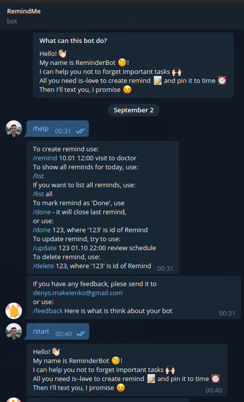

# README

This is a RemindMe Bot. It will help you remember important things through Telegram.
You can add this bot at Telegram as @how_to_find_name_for_bot or by the [link](https://t.me/how_to_find_name_for_bot)



## Available commands

```
To create remind use:
/remind 10.01 12:00 visit to doctor

To show all reminds for today, use:
/list 

If you want to list all reminds, use:
/list all

To mark remind as 'Done', use
/done - it will close last remind, 
or use:
/done 123, where '123' is id of Remind

To update remind, try to use:
/update 123 01.10 22:00 review schedule

To delete remind, use:
/delete 123, where '123' is id of Remind

To send feedback
/feedback text
```

# Installing

This bot is created with [python-telegram-bot](https://github.com/python-telegram-bot/python-telegram-bot)

## Requirments

 - python 3.6+
 - Postgresql 11+
 - python-telegram-bot library v (see in [requirments](requirments.txt))

## Configuring environment

Create `.env` file and add token: (show `.env.example`)
```
    TELEGRAM_TOKEN="your_obtained_token"
```

Install python packages:
```
    pip3 install -r requirments.txt
```

**OR**

use Docker:
```
docker-compose up 
```

## License

Licensed under Apache 2.0. See file [LICENSE](LICENCE)
